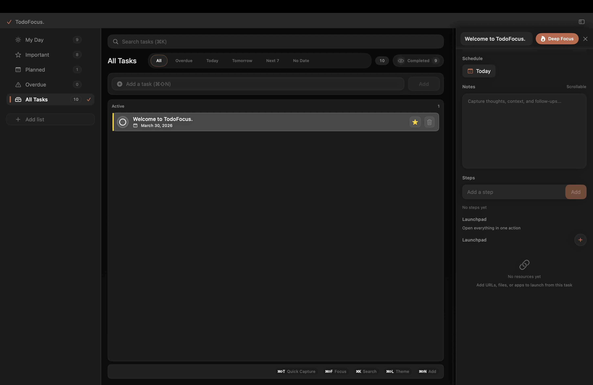

# TodoFocus

<p align="center">
  
</p>

<p align="center">
  <a href="https://github.com/michaelmjhhhh/TodoFocus/releases"></a>
  <a href="https://github.com/michaelmjhhhh/TodoFocus"></a>
</p>

<p align="center">
  
  
  
  
  <a href="LICENSE"></a>
</p>

<p align="center">
  <strong>From "I should do this" to "done" with fewer distractions.</strong>
</p>

<p align="center">
  Pick a task. Launch your context. Enter focus mode. Finish.
</p>

## 30-Second Demo

- `00:00` Pick one task from My Day or Smart Lists
- `00:08` Click `Launch All` to open files/apps/URLs for that task
- `00:15` Start `Deep Focus` (or `Hard Focus` for strict mode)
- `00:25` Use `⌘⇧T` to capture ideas without breaking flow
- `00:30` End session with real progress, not tab chaos

## The Story

You sit down to work on one task.
Five minutes later, your browser has 14 tabs, Slack popped up twice, and the original task is still untouched.

TodoFocus exists to close that gap between intention and execution.

## Before vs After

| Before | After with TodoFocus |
|---|---|
| Task list grows, execution stalls | Select one task and start a focus run |
| Context switching burns energy | `Launch All` restores your work context instantly |
| Distractions break momentum | Deep/Hard Focus reduces interruption paths |
| Ideas get lost mid-session | `⌘⇧T` captures thoughts right away |

## How It Works

### 1. Pick What Matters
- Use My Day, Smart Lists, and search (`⌘K`) to choose your next task

### 2. Restore Context Fast
- Attach `url`, `file`, and `app` resources to each task
- Hit `Launch All` and your workspace is ready in seconds

### 3. Lock In
- Start `Deep Focus` (timed or infinite)
- Enable `Hard Focus` when you need stricter anti-distraction behavior

### 4. Keep Flow
- Use global quick capture (`⌘⇧T`) from any app
- Session stats track focus time and completion momentum

## Feature Highlights

### Focus Engine
- `Deep Focus`: timer or infinite session mode
- `Hard Focus`: stronger anti-distraction lock mode
- Session completion and focus stats tracking

### Task System
- Smart views: overdue, today, tomorrow, next 7 days, no date
- Custom lists with color indicators
- Notes support

### Local-First by Design
- No account required
- SQLite database on your machine
- Database path: `~/Library/Application Support/todofocus/todofocus.db`
- Import/Export with backup-safe replace and merge

## Who This Is For

- You use macOS and want a focused local-first workflow
- You lose time on context switching between task, docs, and tools
- You prefer native speed over web-heavy productivity stacks

## Who This Is Not For

- You need multi-user collaboration and cloud sync first
- You want a lightweight checklist app without focus tooling

## Install

### Fastest Path (Recommended)
1. Open Releases: <https://github.com/michaelmjhhhh/TodoFocus/releases>
2. Download `TodoFocus-macos-universal.zip`
3. Move `TodoFocusMac.app` to `Applications`

### Build From Source

```bash
brew install xcodegen
git clone https://github.com/michaelmjhhhh/TodoFocus.git
cd TodoFocus/macos/TodoFocusMac
xcodegen generate
xcodebuild build -project "TodoFocusMac.xcodeproj" -scheme "TodoFocusMac" -destination "platform=macOS"
```

## First-Run Permissions

Quick Capture uses a global shortcut, so macOS requires Accessibility permission:
`System Settings -> Privacy & Security -> Accessibility`

## Keyboard Shortcuts

| Shortcut | Action |
|---|---|
| `⌘⇧T` | Quick Capture (global) |
| `⌘⇧F` | Start Deep Focus for selected task |
| `⌘⇧N` | Add new task |
| `⌘K` | Search tasks |

## Builder Log

A transparent solo-builder timeline:
- `2026-03-28`: import/export upgrade with preflight, merge mode, and safer replace path
- `2026-03-28`: hard-focus/deep-focus sync fixes and release flow hardening
- `Ongoing`: onboarding polish, docs cleanup, and edge-case stability work

## Project Status

Actively maintained.

If something breaks, open an issue with:
- steps to reproduce
- expected behavior
- actual behavior
- macOS version

Issues: <https://github.com/michaelmjhhhh/TodoFocus/issues>

## Support This Project

1. Star the repo: <https://github.com/michaelmjhhhh/TodoFocus>
2. Share it with one friend who cares about deep work
3. Open an issue with one friction point in your daily workflow

## License

[MIT](LICENSE)
