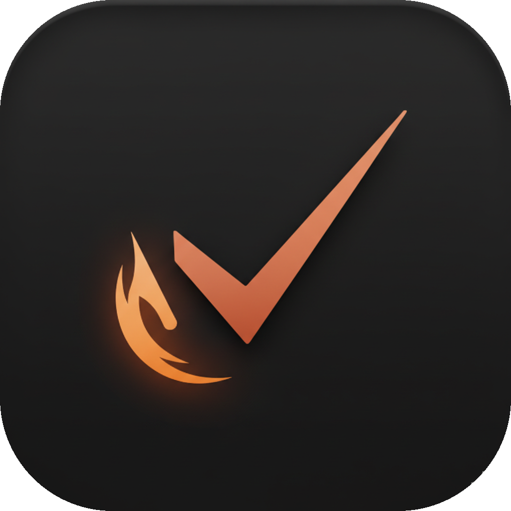

# TodoFocus

<p align="center">
  
</p>

<p align="center">
  <strong>Stop collecting tasks. Start finishing them.</strong><br/>
  A local-first macOS task app that actually helps you finish things.
</p>

<p align="center">
  <a href="https://github.com/michaelmjhhhh/TodoFocus/releases"></a>
  <a href="#build-from-source"></a>
</p>

<p align="center">
  
  
  
  
</p>

<p align="center">
  
</p>

---

## ✨ What this feels like

You’re in the middle of something.

- Too many thoughts  
- Too many tabs  
- Nothing actually getting done  

Then:

⌘⇧T → capture everything  
Start Focus → lock in  
Come back → clean your day  

Flow.

---

## 🧭 Philosophy

Most productivity tools optimize for organization.

TodoFocus optimizes for momentum.

Because the real problem isn’t knowing what to do.

It’s starting.

---

## 😤 The real problem

You don’t need another task manager.

You already know what to do.

You just… don’t do it.

- tasks pile up  
- tabs multiply  
- context disappears  
- focus breaks  

And suddenly the day is gone.

TodoFocus exists for that moment.

---

## 🧠 Why TodoFocus

Most task apps are built to **store tasks**.

TodoFocus is built to **finish them**.

- ⚡ Instant capture (no context switching)  
- 🎯 Built-in focus sessions  
- 🚀 Launch everything you need in one click  
- 🧹 End your day with clarity  

> No login. No cloud. No nonsense.  
> Just you and your work.

---

## ⚡ Capture

- ⌘⇧T global capture  
- Voice input (English `en-US`)  
- Fast task entry from anywhere  

Capture first. Organize later.

---

## 🎯 Focus

### Deep Focus

A built-in focus timer with session stats, menu bar controls, and a workflow that helps you stay with the task.

---

### 🚫 Hard Focus

This is not a timer.

This is a commitment.

Once you start:

- distractions can be blocked  
- quitting requires intention  
- focus becomes harder to escape  

Because focus should not be easy to break.

---

## 🚀 Execute

### Launchpad

Tasks are not just text.

Attach:

- links  
- files  
- apps  

Then launch everything you need in one click.

No hunting. No tab archaeology. No “wait, where was that again?”

---

## 🧹 Review

### Daily Review

Not analytics. Not dashboards. Not guilt.

Just:

- Overdue  
- Today  
- Tomorrow  
- Done  

A clean, fast, honest way to reset your day.

---

## 🪟 Smart Views

- `My Day`  
- `Important`  
- `Overdue`  
- Search with `⌘K`  
- Kanban cleanup for Open vs Completed  

Everything stays close. Nothing feels buried.

---

## 🧨 What makes this different

Most productivity apps try to organize your chaos.

TodoFocus tries to remove it.

No:

- complex systems  
- endless configuration  
- productivity theater  

Just:

- capture  
- focus  
- finish  

---

## 📦 Data & Privacy

- 100% local SQLite  
- No account required  
- No cloud dependency  
- JSON import/export for portability  

Your data lives here:

```bash
~/Library/Application Support/todofocus/
```

---

## ⚡ Quick Start

1. Download the latest release  
2. Move the app to `Applications`  
3. Open it and grant permissions  
4. Hit `⌘⇧T` to add your first task  
5. Start one Focus session  

You’re in.

---

## 🛠 Build From Source

```bash
brew install xcodegen
git clone --recurse-submodules https://github.com/michaelmjhhhh/TodoFocus.git
cd TodoFocus/macos/TodoFocusMac

xcodegen generate
xcodebuild build -project "TodoFocusMac.xcodeproj" -scheme "TodoFocusMac"
```

If you want to inspect or modify the app, the full source code is available here:

- Repository: `https://github.com/michaelmjhhhh/TodoFocus`

---

## 🎬 Demo

<p align="center">
  
</p>

---

## 💬 Feedback

Issues and ideas:

- `https://github.com/michaelmjhhhh/TodoFocus/issues`

---

## ⭐ If this helped you

If TodoFocus helped you finish something you would have procrastinated on:

👉 give it a ⭐

That’s how this grows.

---

task manager macOS, productivity app mac, focus timer app mac, local first todo app
