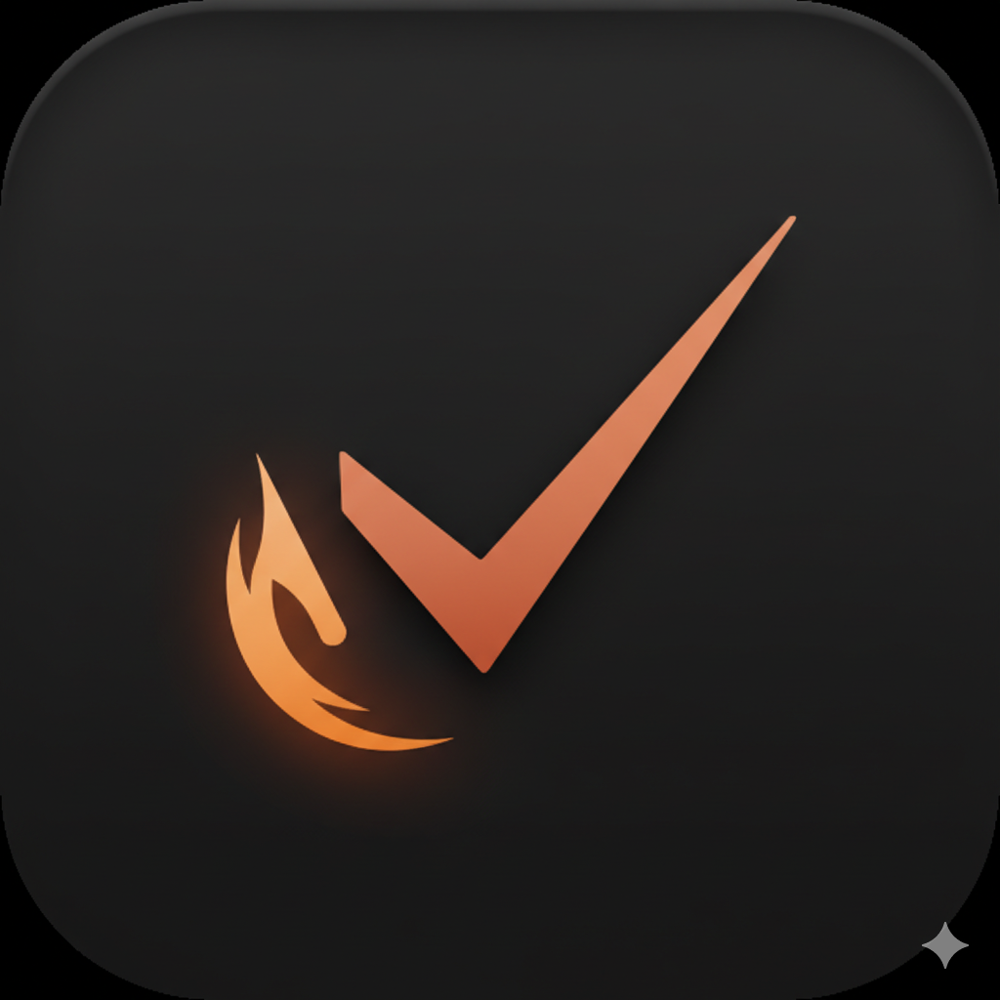

# TodoFocus

<p align="center">
  
</p>

<p align="center">
  <strong>A native, local-first macOS task app for deep work.</strong><br/>
  Capture quickly, launch context in one click, focus with fewer distractions, and review your day in kanban form.
</p>

<p align="center">
  <a href="https://github.com/michaelmjhhhh/TodoFocus/releases"></a>
  <a href="#build-from-source"></a>
</p>

<p align="center">
  
  
  
  
</p>

<p align="center">
  
</p>

## Why TodoFocus

TodoFocus is designed for people who want one lightweight desktop workspace for:

- fast thought capture
- task context launch (`url`, `file`, `app`)
- distraction-resistant focus sessions
- end-of-day review and cleanup

No account required. No cloud dependency required. Data stays on your Mac.

## Feature Overview

| Area | What you get |
|---|---|
| Quick Capture | Global shortcut `⌘⇧T` to capture from anywhere. |
| Voice Capture | English (`en-US`) speech recognition with preview + final commit behavior. |
| Deep Focus | Focus sessions with timer, stats, and menu bar status. |
| Hard Focus | Stronger enforcement mode with app blocking and passphrase-based exit flow. |
| Launchpad | Attach and launch task resources in one action. |
| Daily Review | Kanban-style review with Open/Completed lanes and time buckets. |
| Smart Views | `My Day`, `Important`, `Planned`, `Overdue`, `All Tasks`, and custom lists. |
| Portability | JSON import/export for lists, todos, steps, and URL launch resources. |

## Daily Review

Daily Review is built for manual cleanup and planning.

- Open lane buckets: `Overdue`, `Today`, `Tomorrow`, `Later`, `No Date`
- Completed lane is available and collapsed by default
- Card actions include `Done`, `My Day`, and `Reschedule`
- Lightweight by design (no drag-and-drop board mechanics yet)

## Quick Capture and Voice

- Open Quick Capture globally with `⌘⇧T`
- If Deep Focus is active, captured text appends to focus-task notes with timestamp
- If no Deep Focus is active, captured text creates a new Inbox task
- Voice mode is currently English-only
- Partial transcript is preview-only; final transcript is prioritized for commit
- Short silence can auto-finalize recording

> [!NOTE]
> Quick Capture global shortcut requires Accessibility permission in macOS Privacy settings.

## Launchpad and Safety

Launchpad lets each task carry execution context:

- `url` resources
- `file` resources
- `app` resources

Security model:

- Launch operations use native `NSWorkspace`
- Unsupported payloads are rejected by validation
- No shell command execution path is used for launch resources

## Data and Import/Export

TodoFocus uses local SQLite storage:

- App data dir: `~/Library/Application Support/todofocus/`
- DB file: `~/Library/Application Support/todofocus/todofocus.db`

Import/export behavior:

- Format: JSON
- Portable entities: lists, todos, steps, URL launch resources
- File/app launch resources are intentionally skipped for cross-device portability
- Import supports `merge` and `replace` modes

> [!TIP]
> File and app paths are machine-local. URL-only portability avoids broken resources when moving to another Mac.

## Keyboard Shortcuts

| Shortcut | Action |
|---|---|
| `⌘⇧T` | Global Quick Capture |
| `⌘⇧F` | Start Deep Focus on selected task |
| `⌘K` | Search tasks |
| `⌘⇧N` | Add task to current view |
| `⌘⇧L` | Toggle theme |

## Build From Source

### Requirements

- macOS 14+
- Xcode 16+
- `xcodegen`

### Build and test

```bash
brew install xcodegen
git clone https://github.com/michaelmjhhhh/TodoFocus.git
cd TodoFocus/macos/TodoFocusMac

xcodegen generate
xcodebuild test -project "TodoFocusMac.xcodeproj" -scheme "TodoFocusMac" -destination "platform=macOS"
xcodebuild build -project "TodoFocusMac.xcodeproj" -scheme "TodoFocusMac" -configuration Release -derivedDataPath "build/DerivedData" -destination "platform=macOS"
```

## Quick Start

1. Download the latest release from GitHub.
2. Move `TodoFocusMac.app` to `Applications`.
3. Open once and grant requested permissions.
4. Create one task, add one URL resource, then run one Deep Focus session.
5. Trigger `⌘⇧T` and verify Quick Capture flow.

## Troubleshooting

### Quick Capture shortcut does not trigger

- Re-check Accessibility permission
- Relaunch app after granting permission
- Re-grant permission after app re-sign/rebuild

### Voice capture is inaccurate or feels slow

- Confirm Microphone + Speech Recognition permissions
- Use short complete phrases and pause briefly for finalization
- Reduce background noise and prefer stable audio input

### Build fails after project changes

Run:

```bash
cd macos/TodoFocusMac
xcodegen generate
```

## Demo

<p align="center">
  
</p>

## Feedback

Issues and feature requests:

- https://github.com/michaelmjhhhh/TodoFocus/issues

If this project helps your workflow, starring the repository is appreciated.
